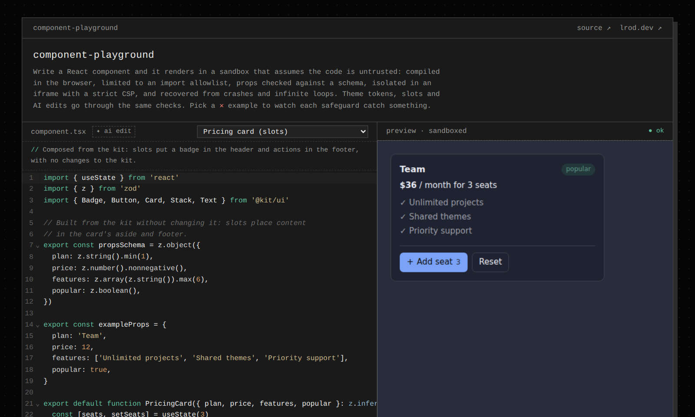

# component-playground

Write a React component, restyle it with theme tokens, or ask an AI to edit it, and watch it render inside a sandbox that assumes all of that code is untrusted.

**Live:** [playground.lrod.dev](https://playground.lrod.dev) · **Write-up:** [Running untrusted React components in the browser](https://lrod.dev/notes/running-untrusted-components/) · **Stack:** React · TypeScript · Vite · Sucrase · Zod · CodeMirror



## Why this exists

Page builders, plugin systems and customizable dashboards all let users extend the UI with their own code, and all of them have to run that code without putting the rest of the app at risk. I built this to show how, with each safeguard paired with a failure case you can trigger in the demo.

The constraints that shaped it:

- **Assume the code is hostile or just broken.** Both have to fail safely, and look the same to the host.
- **No server.** Everything, including compilation, happens in the browser, so the demo is a static site.
- **Every safeguard is observable.** If it can't be demonstrated in the failure gallery, it isn't claimed.
- **Customize by composing, not editing.** Users extend a shared component kit through theme tokens and slots; the kit itself stays read-only.
- **AI output is just more untrusted code.** It's reviewed as a diff and goes through the same checks as anything typed by hand.

## What it demonstrates

Letting people run their own UI code inside your app without letting that code break, hang, or reach into the host page:

- **Compile** TSX in the browser
- **Scope** imports to an allowlist
- **Validate** props against a schema before rendering
- **Isolate** rendering in a sandboxed iframe with a strict CSP
- **Recover** from render errors and infinite loops
- **Theme** the kit with validated design tokens
- **Compose** with slots, each behind its own error boundary
- **Edit with AI** (bring your own OpenAI key), reviewed as a diff before anything runs

## Writing a component

A module can export three things:

```tsx
import { z } from 'zod'
import { Card, Text } from '@kit/ui'

// optional: the props contract, checked before every render
export const propsSchema = z.object({ name: z.string().min(1) })

// optional: props to render with when the props editor is empty
export const exampleProps = { name: 'Ada' }

// required: the component
export default function Hello({ name }: z.infer<typeof propsSchema>) {
  return <Card title={`Hello, ${name}`}><Text>👋</Text></Card>
}
```

Imports are limited to `react`, `zod` and `@kit/ui` (`Card`, `Stack`, `Text`, `Button`, `Badge`).

### Customizing the kit

The kit can't be edited or patched (it's frozen); it's customized two ways:

- **Theme tokens** in the theme tab: `accent`, `surface`, `text` (hex colors), `radius`, `space`, `fontScale` (bounded numbers). Text on surface must meet 4.5:1 contrast.
- **Slots** for component parts: `Card` takes `header`, `aside` and `footer`; `Button` takes `icon` and `end`.

```tsx
<Card title="Team" slots={{ aside: <Badge tone="success">popular</Badge>, footer: <Button>Buy</Button> }}>
  …
</Card>
```

### AI edits

Open **✦ ai edit**, paste an OpenAI API key, and describe a change. The key stays in that panel's memory only: it isn't stored, is sent only to `api.openai.com`, and never reaches the sandbox. The model's reply replaces the editor with a review view (diff, plus compile and import checks on the proposal). Nothing runs until you accept, and accepted code goes through the normal pipeline. Two demo responses, one of them malicious, work without a key.

Use a restricted key (Responses: write, nothing else) with a spend limit.

## Failure gallery

Every safeguard has an example that trips it on purpose (pick one from the ✕ list in the editor):

| Example | Caught by | Result |
|---|---|---|
| Disallowed import | host import scan | `import error`, code never runs |
| Dynamic `require(name)` | sandbox `require` | `evaluate error` |
| Invalid props | Zod `propsSchema` | `validate error` with each issue |
| Throw during render | error boundary | `render error` |
| Throw in a click handler | `window.onerror` in the sandbox | `runtime error` |
| `while (true) {}` | loop guard | `render error` after 1s |
| Regex backtracking | watchdog | sandbox restarted after 3s |
| `fetch()` | CSP `connect-src 'none'` | request blocked |
| `window.parent.document`, cookies, storage, top navigation | opaque origin + sandbox flags | `SecurityError` |
| CSS injection in a theme token | theme schema (hex colors, bounded numbers only) | issues listed, last valid theme kept |
| Unreadable theme | whole-theme contrast rule (4.5:1) | issues listed, last valid theme kept |
| A slot that throws | per-slot error boundary | `slot error`; only that slot is replaced |
| Patch the kit (`ui.Button = …`) | frozen kit module | `evaluate error` (`TypeError`) |
| AI proposal adds `axios` and `fetch()` (demo response) | pre-check on the proposal, then import allowlist and CSP | flagged in review before it can run |

## How it works

```
Host page (trusted)                        Sandbox iframe (untrusted)
───────────────────                        ─────────────────────────────
AI panel ─▶ api.openai.com
   │ proposal (untrusted)
   ▼
review: diff + pre-check ─ accept ─┐
                                   ▼
editor ─▶ compile TSX (Sucrase)            sandbox="allow-scripts", opaque origin
           │ syntax error → shown here     CSP: connect-src 'none', no external code
           ▼
   postMessage {render, id, code}  ─────▶  evaluate module with a scoped require()
   postMessage {theme}  ───────────────▶  re-check tokens, set CSS variables
                                           render inside an error boundary
   ◀────── {rendered | error{phase}} ───── report errors (evaluate / validate / render / runtime)
```

- **Compile in the host.** It's a pure string transform, so syntax errors show even if the sandbox is down.
- **Execute in the sandbox.** Everything that runs user code happens inside the iframe.
- **Theme tokens travel as data.** The host sends validated tokens; the sandbox re-checks them and sets each one as a CSS variable with `setProperty`.
- **Validate both directions.** Messages are checked with Zod on both sides and tagged with a render id, so a slow, stale result can't overwrite a newer one.

## Key decisions

| Decision | Why | Tradeoff |
|---|---|---|
| **Sucrase for in-browser compile** | Small and fast; strips types and rewrites JSX and imports, which is all a preview needs. | No type-checking. |
| **Imports become `require()` calls** | Sucrase's `imports` transform gives one choke point where the runtime decides which modules exist. | CommonJS-style output instead of native ES modules. |
| **Sandboxed iframe without `allow-same-origin`** | The frame gets an opaque origin: no access to the host's DOM, cookies or storage, enforced by the browser. | Its own scripts load cross-origin, so `/assets/*` is served with `Access-Control-Allow-Origin: *`. |
| **Import allowlist, checked twice** | The host scans compiled `require()` calls and rejects anything outside `react`, `zod` and `@kit/ui` before sending code; the sandbox's `require` enforces the same list, which also catches computed names like `require(someVar)`. | Only a fixed set of modules is available. Globals like `window` aren't covered by the allowlist; the iframe and CSP contain those. |
| **Props schema validated in the sandbox** | The schema is user code, so it runs where user code runs. Invalid props show as a list of issues and the component never sees bad data. | Duck-typed (`safeParse`), so any Zod-compatible schema works; there's no check that the schema matches the component's TypeScript types. |
| **Loop guard (code instrumentation)** | Every loop gets a time check (via acorn + magic-string) that throws after 1s, so infinite loops become ordinary errors in every browser. | Adds a function call per iteration; it's a usability safeguard, not a security boundary. |
| **Watchdog (heartbeat + restart)** | The host pings the sandbox every second; after 3s of silence it throws the iframe away and starts a fresh one, without resending the code that hung. | Relies on the iframe running on its own thread. Chromium isolates sandboxed frames in their own process; browsers that don't can freeze the tab while the sandbox is stuck. |
| **CSP inside the sandbox** | `connect-src 'none'` blocks `fetch`/XHR/WebSocket, so user code can't send data anywhere. | Needs `'unsafe-eval'` because user code runs via `new Function`; the CSP is added to production builds only, since the dev server needs HMR. |
| **`postMessage` with target `'*'`** | An opaque origin can't be addressed by name. Both sides instead check `event.source` and validate the payload. | Messages must never carry anything sensitive; they only carry the user's own code and render status. |
| **Theme tokens instead of custom CSS** | A small set of typed tokens (hex colors, bounded numbers) can't carry extra CSS, and whole-theme rules like contrast can be checked. Each value is set with `setProperty`, never concatenated into a stylesheet. | Far less expressive than arbitrary CSS; derived colors come from `color-mix()`. |
| **Slots, each with its own error boundary** | Users change layout without touching kit code, and a broken slot is replaced by a placeholder while the rest of the component renders. | Only the parts the kit exposes as slots can be customized. |
| **Read-only kit** | The kit is passed to user code as a frozen object of frozen components, so replacing or patching one throws instead of silently changing the kit. | Customization has to go through tokens and slots, by design. |
| **AI edits: bring your own key, no server** | Keeps the demo a static site with nothing that spends someone else's money. The key stays in the AI panel's memory. | Visitors need their own OpenAI key for live edits; two canned responses show the flow without one. |
| **AI output treated as untrusted input** | The reply is strict JSON checked with Zod, shown as a diff, and pre-checked (compile + import scan) before you decide. Accepting only puts it in the editor. | A model can still propose code that passes static checks and misbehaves at runtime; the sandbox is what contains that. |
| **CSP on the host page too** | `connect-src 'self' https://api.openai.com` means the key can only ever go to OpenAI, and `script-src 'self'` rules out injected scripts on the page that holds it. | Adding a provider means adding its origin to the policy (one list in `src/csp.ts`). |

## Limitations

Known and accepted:

- **No type-checking.** Sucrase strips TypeScript types without checking them, and `propsSchema` isn't verified against the component's prop types.
- **No CPU or memory limits.** The loop guard and watchdog recover from hangs, but a component can still use a lot of memory or CPU before that happens.
- **Browser differences.** The watchdog relies on the sandboxed iframe running on its own thread. Chromium isolates sandboxed frames in a separate process; other browsers may freeze the whole tab until the watchdog or the loop guard fires.
- **Side channels aren't in scope.** Timing and rendering side channels (e.g. measuring layout) aren't mitigated.
- **The API key is visible to the page that holds it.** CSP limits where it can be sent, but anything running on the host page could read it. Use a restricted key with a spend limit.
- **Prompt injection isn't prevented, only contained.** Instructions hidden in the code could steer the model; its output still has to pass review and every check before it runs.
- **The loop guard is best-effort.** It's code instrumentation, so determined code can get around it; the watchdog is the backstop.

## Performance

The page shell loads first; the editor (CodeMirror) and the compiler (Sucrase + acorn) are split into their own chunks and load in parallel, so the first render doesn't wait on the two largest dependencies.

## Local development

```bash
npm install
npm run dev        # http://localhost:5173
npm test           # unit tests (Vitest)
npm run lint       # oxlint
npm run build      # type-check + production build to dist/
```

Both CSPs (host and sandbox) are only added to production builds (the dev server needs HMR), so check network blocking with `npm run build && npm run preview`.

Requires Node 20.19+ (see `.nvmrc`).

## License

MIT
